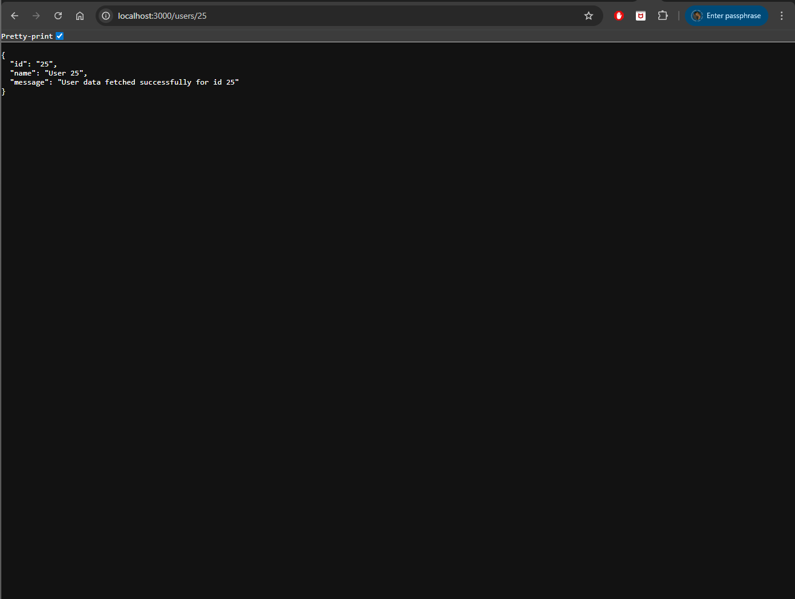

# express-project-03-route-params-api

A simple Express.js backend project demonstrating how to use route parameters in an API.

## Concept

This project shows how dynamic route parameters work in Express.js using the following pattern:

```
/users/:id
```

The `id` is captured from the URL and accessed using:

```
req.params.id
```

## Tech Stack

- Node.js
- Express.js

## Project Structure

```
express-project-03-route-params-api
│
├─ src
│  ├─ controllers
│  │  └─ user.controller.js
│  │
│  └─ routes
│     └─ user.routes.js
│
├─ index.js
├─ package.json
└─ .gitignore
```

## Installation

Clone the repository

```bash
git clone https://github.com/a2rp/express-project-03-route-params-api.git
cd express-project-03-route-params-api
```

Install dependencies

```bash
npm install
```

## Run the Server

```bash
node index.js
```

Server runs at:

```
http://localhost:3000
```

## API Endpoint

### Get User by ID

```
GET /users/:id
```

Example:

```
http://localhost:3000/users/25
```



Response:

```json
{
    "id": "25",
    "name": "User 25",
    "message": "User data fetched successfully for id 25"
}
```

## Learning Outcome

This project demonstrates:

- Express route parameters
- Dynamic API routes
- Controllers and route separation
- Basic backend architecture

## Author

Ashish Ranjan

---

Follow me:

- GitHub: https://github.com/a2rp
- Portfolio: https://www.ashishranjan.net
- LinkedIn: https://www.linkedin.com/in/aashishranjan
- Facebook: https://www.facebook.com/theash.ashish/

## Links

- Portfolio: [https://www.ashishranjan.net](https://www.ashishranjan.net)
- GitHub: [https://github.com/a2rp](https://github.com/a2rp)
- CodePen: [https://codepen.io/ash1198](https://codepen.io/ash1198)
- LinkedIn: [https://www.linkedin.com/in/aashishranjan](https://www.linkedin.com/in/aashishranjan)
- Facebook: [https://www.facebook.com/theash.ashish/](https://www.facebook.com/theash.ashish/)
- YouTube: [https://www.youtube.com/@ashishranjan-ashz?sub_confirmation=1](https://www.youtube.com/@ashishranjan-ashz?sub_confirmation=1)
- Email: [ash.ranjan09@gmail.com](mailto:ash.ranjan09@gmail.com)

## Support

- Support: [https://a2rp-donation-page.netlify.app/](https://a2rp-donation-page.netlify.app/)
- Buy Me A Coffee: [https://buymeacoffee.com/a2rp](https://buymeacoffee.com/a2rp)
- Patreon: [https://patreon.com/a2rp](https://patreon.com/a2rp)